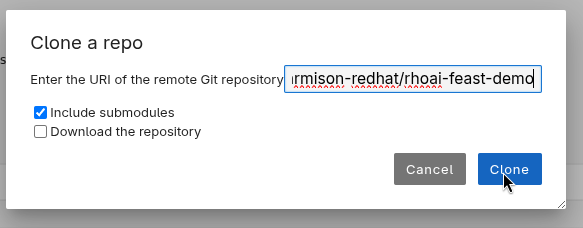

# Real-time Credit Scoring with Feast on OpenShift AI

## Overview

This tutorial is built from the original **[feast-credit-scoring-tutorial](https://github.com/feast-dev/feast-credit-score-local-tutorial/tree/598a270353d8a83b37535f849a0fa000a07be8b5)**.

This tutorial demonstrates the use of Feast as part of a real-time credit scoring application inside OpenShift AI.

- The primary training dataset is a loan table. This table contains historic loan data with accompanying features. The dataset also contains a target variable, namely whether a user has defaulted on their loan.
- Feast is used during training to enrich the loan table with zipcode and credit history features from the **data** folder inside **feature_repo**.
- Feast is also used to serve the latest zipcode and credit history features for online credit scoring using PostgreSQL.

## Requirements

- OpenShift AI 3.2 or newer
- Your own Data Science Project for testing
- Any Python 3.11 (not 3.12) based notebook (tested with `Jupyter | Data Science | CPU` version `2025.1` for Python 3.11)
- Either Feast Operator already set to `Managed` in your `DataScienceCluster`, or enough permission to update it to be

## Starting the demo

1. In your Jupyter environment, clone this repository
   1. Press the **Git Clone** button at the top of the navigation bar to the left:
      
   1. Paste the address to this repository in the text box before selecting **Clone**:
      
1. Navigate to the directory for the repository, open `00-deploy.ipynb`
1. Follow the instructions there, step by step, to:
   1. Deploy Feast
   1. Configure features
   1. Train a model using historical features
   1. Perform inference with online features
